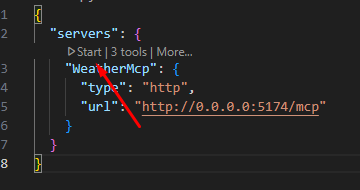
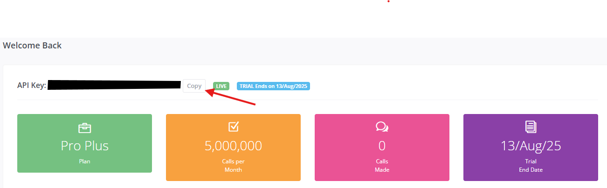

# Project setup

1. Go to `appsettings.json` and setup your own [API key](#get-api-key)
2. Run project
3. Open project folder with VS Code
4. Click Start 

# Get API Key
1. Go to [Weather API](https://www.weatherapi.com)
2. Sign up and confirm your email
3. Go back to site, and click **My Account**
4. Copy API Key 